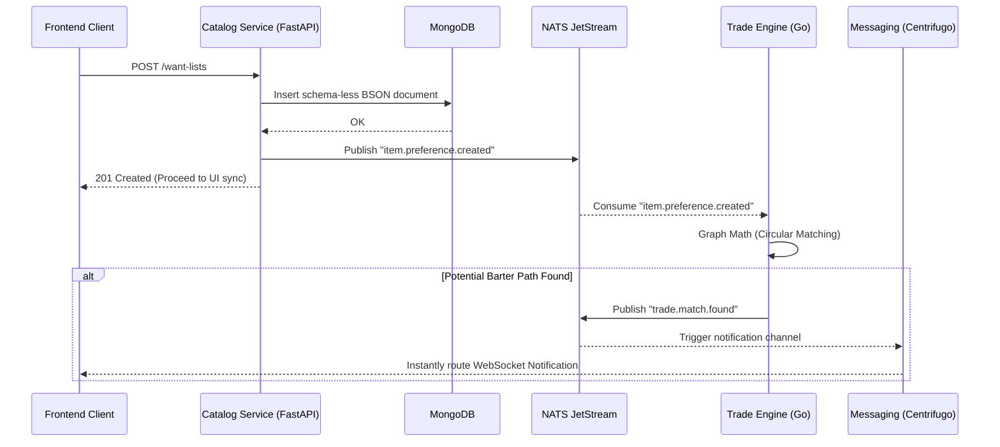

# EcoBarter (SwapSphere/TradeNexus) Microservices Architecture & Project Plan

## 1. Domain-Driven Design (DDD) Map

The EcoBarter platform is divided into 5 core business capabilities, modeled as bounded contexts to ensure decentralized resilience.

### Identity Service
- **Runtime**: FastAPI
- **Domain Responsibilities**: Authentication (OAuth2, JWT), Authorization, and User Registration. Ensures server-to-server security and user identity verification.
- **Data Store**: PostgreSQL (for rigid credential boundaries)

### Catalog Service (Listing Service)
- **Runtime**: FastAPI
- **Domain Responsibilities**: CRUD operations for unstructured items, services, and Want Lists. Implements geospatial queries ("Near Me") and subjective attribute storage.
- **Data Store**: MongoDB (BSON)

### Trade Engine
- **Runtime**: Go (Gin/Fiber)
- **Domain Responsibilities**: The core bartering logic. Calculates 2-way and K-way circular matches. Handles complex, multi-item swap state transitions and ensures structural integrity of exchanges.
- **Data Store**: PostgreSQL (ACID constraints necessary for transactional ledgering)

### Reputation Service
- **Runtime**: FastAPI
- **Domain Responsibilities**: Trust and safety protocols. Manages the "Trade Momentum", calculates custom "Environmental Impact" scoring, and curates immutable user review/rating logic. Contains escrow and Proof of Exchange records.
- **Data Store**: PostgreSQL

### Messaging Service
- **Runtime**: Centrifugo (Standalone)
- **Domain Responsibilities**: The real-time negotiation engine. Handles massive horizontal websocket connections independently of the core domains. Supports stateless routing.
- **Data Store**: Redis (for syncing messages across nodes and ephemeral presence tracking)

---

## 2. "Want List" Data Model (Catalog Service)

Leveraging MongoDB's document-oriented environment, we use a schema-less structure for the "Want List" to seamlessly capture highly subjective user preferences (e.g., varying conditions, flexible service arrangements or abstract requests).

```json
{
  "_id": "ObjectId('655b3c...')",
  "userId": "uuid-v4-identity-link",
  "listType": "digital-barter-preference",
  "desiredAssets": {
    "category": "Electronics",
    "subjectiveCriteria": {
      "preferredBrands": ["Sony", "Nintendo"],
      "minimumCondition": "Fair",
      "acceptableFlaws": ["cosmetic-wear", "no-manuals"]
    },
    "serviceAlternatives": {
      "willingToAccept": ["Graphic Design", "Custom Coding"],
      "minimumHoursValue": 10
    },
    "valuationRange": {
      "estimatedValue": { "min": 250, "max": 400, "currency": "USD" },
      "negotiationFlexibility": 0.8
    }
  },
  "geospatialRadius": {
    "type": "Point",
    "coordinates": [-71.0589, 42.3601],
    "maxDistanceMeters": 25000 
  },
  "status": "processing",
  "createdAt": "2026-04-09T14:30:00Z"
}
```
*By retaining a BSON payload, `subjetiveCriteria` and `serviceAlternatives` remain unstructured, avoiding the overhead of maintaining sparse fixed columns when dealing with unpredictable item classes.*

---

## 3. Event-Driven Workflow: NATS JetStream

**Scenario:** A user creates a "Want List" which must immediately cue the Trade Engine to search for viable exchange circles.

### Async Execution Pathway
1. **User Request**: User issues a `POST /want-lists/` to the **Catalog Service**.
2. **Document Persistence**: Catalog Service saves the unstructured payload to MongoDB and acknowledges the client via `201 Created`.
3. **Event Emitted**: Catalog Service publishes an `item.preference.created` event subject to the **NATS JetStream** message broker.
    - *Payload Signature*: Incorporates `wantListId`, `userId`, `category`, and `valuationRange`.
4. **Subscription Consumption**: The **Trade Engine (Go)** is subscribed to the `item.preference.*` wildcard topics and parses the incoming stream almost instantly (sub-millisecond latency).
5. **Matching Matrix Run**: The Trade Engine begins asynchronous K-way matching calculations graph traversals, assessing compatibility.
6. **Result Propagation**: Once a circular trade is matched, the Trade Engine publishes a new message: `trade.match.found`.
7. **Real-time Delivery**: The **Messaging Service (Centrifugo)** consumes this new feed and blasts WebSocket notifications routing back to the appropriate connected users' interfaces.

### Architectural Diagram


